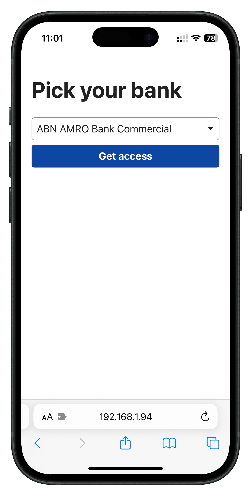

## Buffet

Buffet is quick proof of concept to bring PSD2 together with Claude.ai

### Configure

Copy the `.env.example` file to `.env` and fill in your Gocardless (Nordigen) API key and you Anthropic key.

### How to run

Buffet is a tiny Ruby Sinatra app.

```bash
bundle install
ruby app.rb # starts the webserver at http://localhost:4567
```



